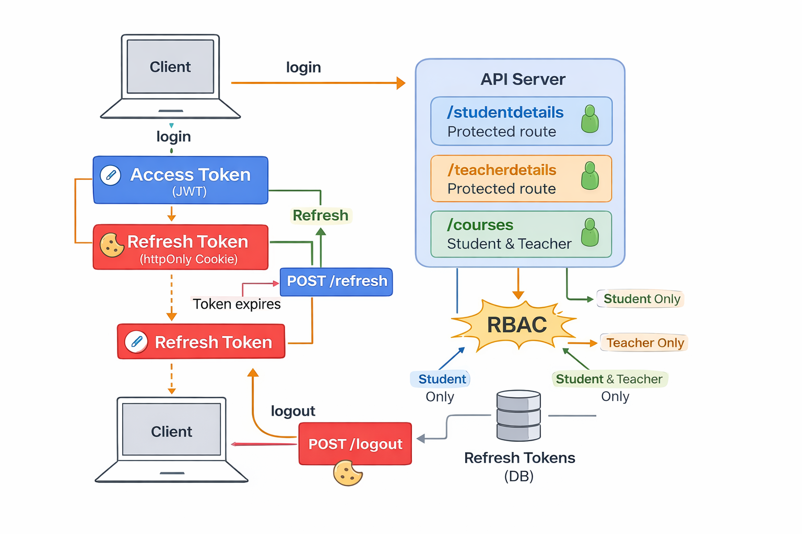

# 🔐 Auth REST API (JWT + Refresh Token + RBAC)

A **production-grade authentication & authorization API** built with **Node.js, Express, and MongoDB**, implementing **JWT access tokens, refresh tokens, and role-based access control (RBAC)**.

---
## 🔐 Authentication Flow

---
## 🔑 Token Strategy (Why it works)

This API uses **two-token authentication** to balance **security** and **user experience**.

### Access Token
- **Lifetime:** 15 minutes
- **Purpose:** Authorize API requests
- **Where used:** `Authorization: Bearer <token>`
- **Why short-lived:**
  - Limits damage if token is stolen
  - No server-side storage needed
  - Keeps protected APIs stateless & fast

### Refresh Token
- **Lifetime:** 7 days
- **Purpose:** Maintain user session
- **Where stored:** httpOnly cookie + hashed in DB
- **Why long-lived:**
  - Prevents frequent re-login
  - Enables silent access-token renewal
  - Allows proper logout & session invalidation

### How they work together
Login → Access Token (15m) + Refresh Token (7d)
Access Token expires → /refresh → New Access Token
Refresh Token expires → User logs in again

### Logout behavior
- Refresh token is revoked server-side
- Refresh cookie is cleared
- Access token expires naturally

This ensures **secure sessions without forcing frequent logins**.

## 🛡️ Role-Based Access Control (RBAC)

Authorization is enforced **after authentication** using stateless middleware.

- Roles are embedded in the access token
- No database calls during authorization
- Route-level permission checks

| Route | Access |
|------|-------|
| `/studentdetails` | Student |
| `/teacherdetails` | Teacher |
| `/courses` | Student & Teacher |

---

## 🚀 API Endpoints

### Auth
- `POST /api/signup`
- `POST /api/login`
- `POST /api/refresh`
- `POST /api/logout`

### Protected
- `GET /api/studentdetails`
- `GET /api/teacherdetails`
- `GET /api/courses`

